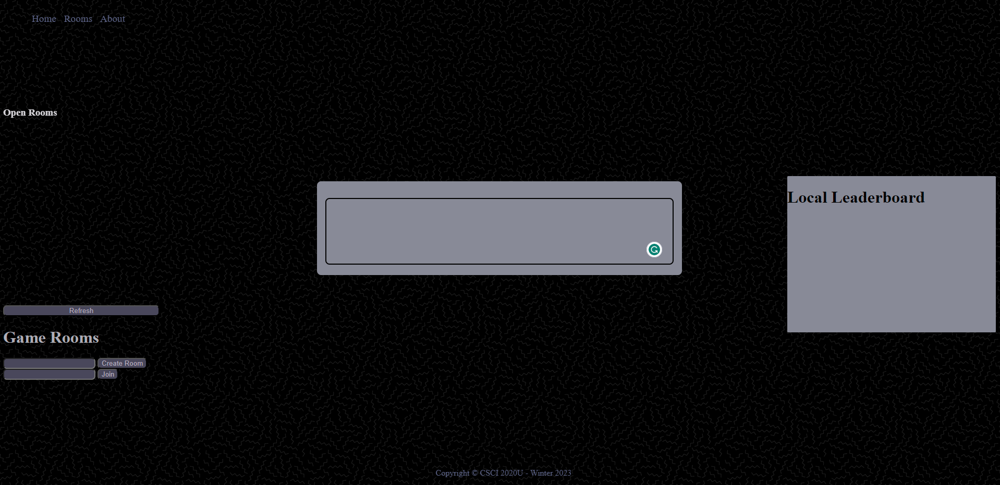
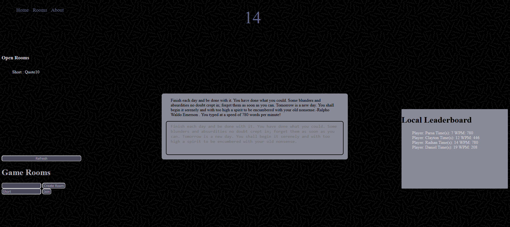
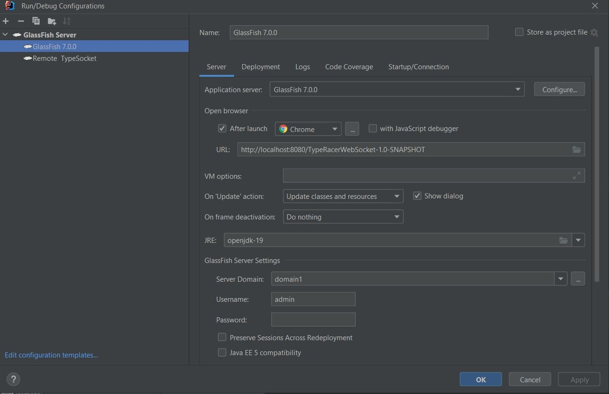
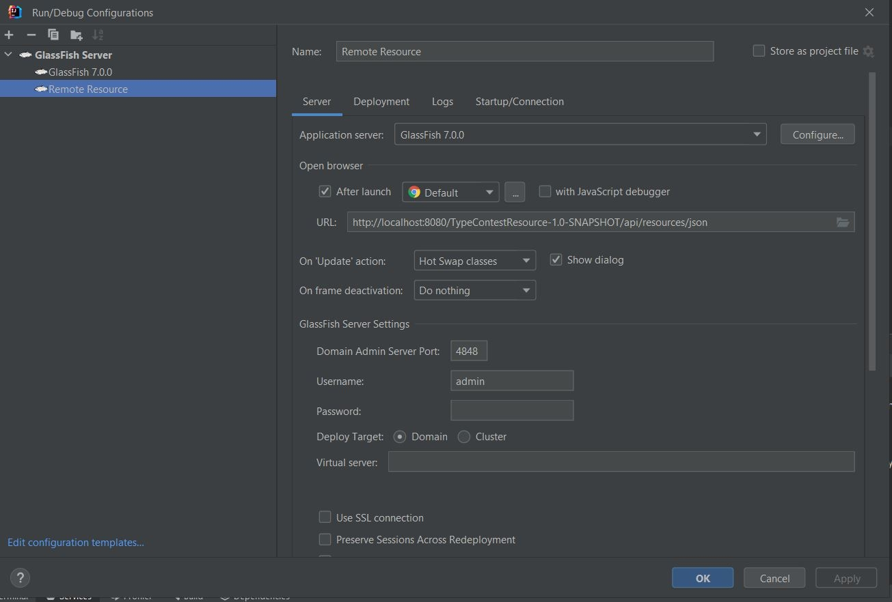

## readme.md

### Project Information

The project is a real-time web-based typing game called "Type Racer". The goal of the game is to bring people to a specific room and give them a randomly generated text, which they all start typing as fast as possible. The website records their Word Per Minute (WPM) and speed and makes a leaderboard at the end. The project uses websockets and RestAPI to handle the real-time communication between the players and the server. The server keeps track of the game state, including the text to be typed, the scores of the players, and the current leaderboard. The client-side JavaScript code handles the user interface of the game and interacts with the server through websockets to update the game state and display the results to the players.

The code was adapted from (https://github.com/WebDevSimplified/JS-Speed-Typing-Game), This guided the work

&nbsp;

This figure is the base website

&nbsp;

This is a figure of the running website

&nbsp;

### How To Run

1. Clone this repository into your desired folder.

2. Launch this repository in intelliJ with administrator privileges.

3. Add a configuration to open a local GlassFish server with OpenJDK and also have a configuration to run a remote server.

4. Launch any .html page through intelliJ by running it as the current file, which is in the same drop down as the GlassFish configuration, then hit the 'play' button.

5. Navigate to index.html in the 'TypeRacerWebsocket' file with the navigation bar

6. When on the website create a new room by typing a code of your choosing or join an existing room in the same server

7. Once in the room, begin the typing with the goal being speed, so make sure you are quick. They are also measures to ensure accuracy as the game does not end until the quote generated is typed completely

8. After being prompted for a username insert one in and your leaderboard position is uploaded.

9. You can start the game again by refreshing or entering another room.

&nbsp;

This figure is the WebSocket Configuration used to run the game

&nbsp;

This figure is the ResourceAPI Configuration used to run the game

&nbsp;

### Resources

[w3Schools](https://www.w3schools.com/)

- General css documentation

[Coolors](https://coolors.co/eae8ff-d8d5db-adacb5-2d3142-b0d7ff)

- Colour pallette help

[WebDevSimplified](https://github.com/WebDevSimplified/JS-Speed-Typing-Game)
- Helpful Guide

[webtoolkit](https://www.webtoolkit.eu/wt)

- Scrollbar manipulation

[GoodReads](https://www.goodreads.com/quotes?page=1)

- Quotes Storage

[BackGround](https://www.toptal.com/designers/subtlepatterns/uploads/memphis-mini-dark.png)

- The BackGround Picture for the website

[Youtube Video](https://youtu.be/P-CLCK5xBrI)

- The Finalized YouTube Video

&nbsp;

### Credits

This assignment was completed by:

- Parsa Zahraei Mohammadabady 100749173
- Clayton Cotter-Wasmund 100824037
- Daniel Baba 100828105
- Raihan Mosharrof 100823087
